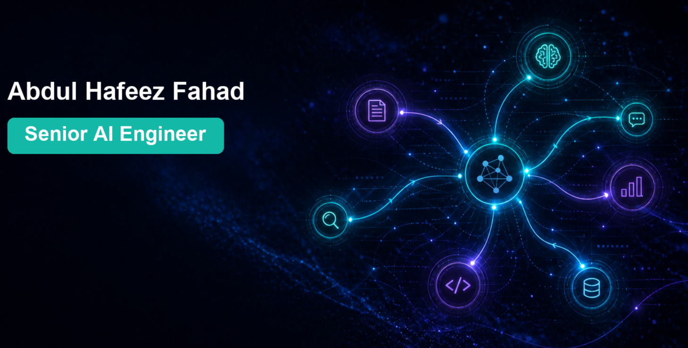
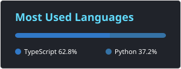

  

  

<h2>📖 About Me</h2>

I'm **Abdul Hafeez Fahad**, a Senior AI Engineer based in Islamabad, Pakistan (working remotely with US teams). I have 7+ years of software and AI engineering experience, focused on Generative AI, LLMs, and agentic systems.

I design production-grade AI platforms that are scalable, secure, and cost-efficient — turning business needs into systems with measurable operational impact.

<h2>💼 Experience</h2>

**Senior AI & ML Engineer** — EdTech Ventures (Austin, Texas · Remote) · 2026–Present  
Owning the AI product layer for a career platform: guidance, resume intelligence, candidate evaluation, and personalized recommendations. Building the foundation for production-ready AI, including evaluation criteria and model-behavior validation.

**Senior AI Engineer** — Mobiz (Houston, Texas) · 2024–2026  
Technical lead for enterprise AI on Azure: agent systems, RAG, document intelligence, and backend platforms (Python / FastAPI / Next.js). Work spanned retrieval, evaluation, and delivery of production AI used across business teams.

**Machine Learning Engineer – L4** — RedBuffer (Islamabad, Pakistan) · 2020–2024  
End-to-end ML across computer vision, NLP, generative models, and model deployment (including registries and GPU/serverless serving).

**Junior Software Engineer** — Target Systems (Pvt) Ltd. (Islamabad, Pakistan) · 2019–2020  
CRM workflows, SQL operations, and client support.

<h2>🎓 Education</h2>

**B.S. Computer Science** — National University of Computer and Emerging Sciences (FAST), Islamabad · 2015–2019  
Coursework in Data Mining and Natural Language Processing.

**SSC & HSSC** — Overseas Pakistanis Foundation (OPF), Islamabad · 2012–2015

<h2>🏅 Certifications</h2>

- Microsoft Certified: Azure AI Engineer Associate
- Anthropic: Introduction to Agent Skills · Building with the Claude API · Introduction to MCP · Claude Code in Action
- DeepLearning.AI & LangChain: AI Agents in LangGraph
- Google Cloud Skills Boost: Build Intelligent Agents with Agent Development Kit (ADK)

<h2>🎤 Speaking</h2>

Featured speaker at Google DevFest (2025), Google Developer Group Fest (2025), Google Cloud Event (2025), Google I/O Extended (2024), and AI Odyssey DevFest (2023). I also run hands-on workshops on Agentic AI, Google ADK, and Gemini for 100+ developers across GDG events.

<h2>🛠 Skills</h2>

**AI:** Generative AI, LLMs, agents & multi-agent systems, RAG, embeddings & vector search, multimodal AI, NLP, computer vision & OCR, prompt engineering, RAGAS evaluation.

**Frameworks:** Microsoft Agent Framework, Semantic Kernel, LangChain, LangGraph, Claude Agent SDK, Google ADK, Microsoft Copilot Studio.

**Platforms & engineering:** Azure (AI Foundry, Azure OpenAI, Document Intelligence, Databricks, Functions), GCP, Python, TypeScript, FastAPI, PostgreSQL, Azure AI Search, Redis, MongoDB, Docker, CI/CD, LangSmith, Application Insights.

  
  
  
  
  
  
  
  
  
  
  
  

<h2>💬 Let's Connect</h2>

  
  
  
  
  

  

 

<h2 align="center">GitHub Statistics 📈</h2>

  
  

<!--
fahad-aidev/fahad-aidev is a special repository: this README appears on your GitHub profile.
-->
